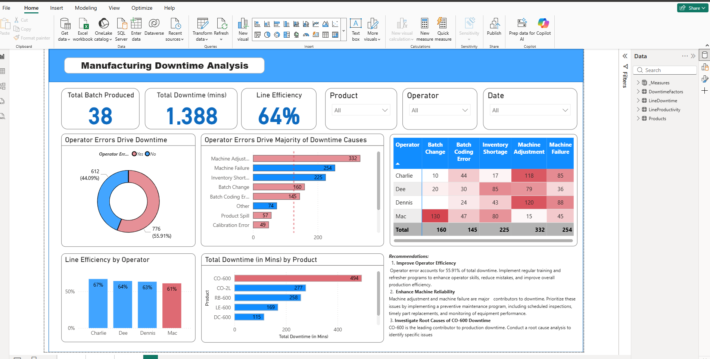

# Manufacturing Downtime Analysis Dashboard

## Project Overview
This Power BI dashboard analyzes manufacturing downtime, operator efficiency, and machine-related production issues. The dashboard helps identify the major causes of downtime and provides operational insights for improving production efficiency.

## Tools Used
- Power BI
- DAX
- Data Modeling
- Data Visualization

## Key Features
- KPI cards for total production, downtime, and efficiency
- Downtime analysis by operator and product
- Root cause visualization of downtime events
- Interactive slicers and filters
- Recommendation section for operational improvements

## Key Insights
- Operator-related issues account for a significant portion of downtime
- Machine adjustment and machine failure are the leading causes
- Product CO-600 has the highest downtime duration
- Operator performance varies across production lines

## Dashboard Preview

## Dataset
Sample manufacturing operations dataset used for portfolio and learning purposes.
